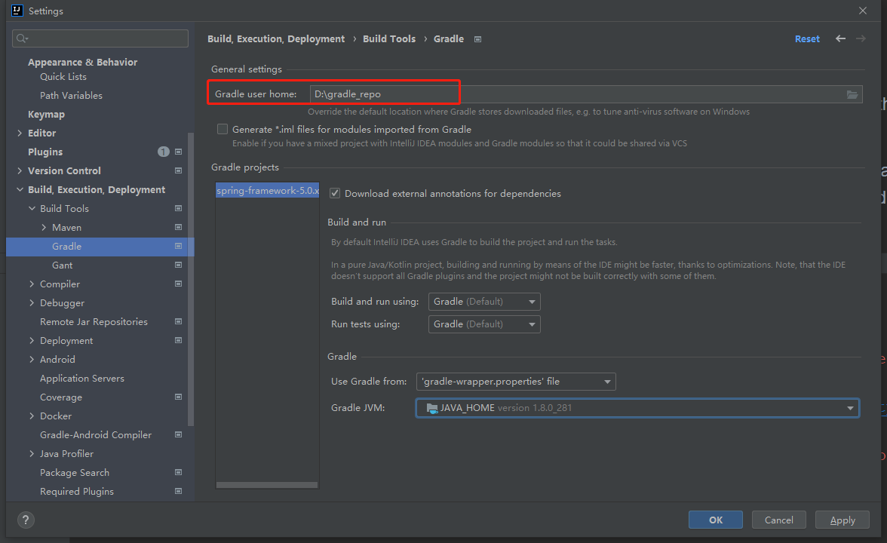
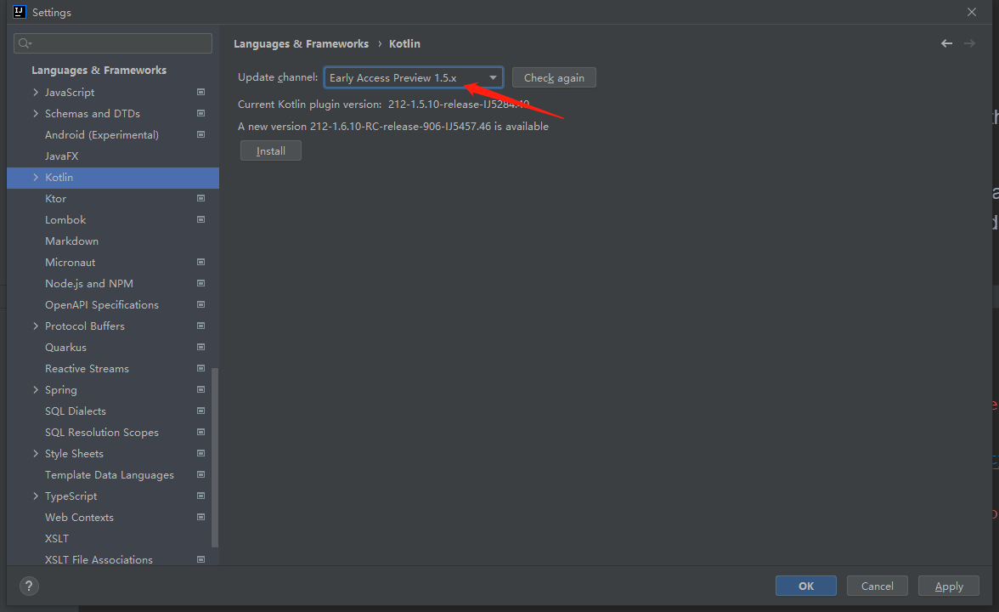
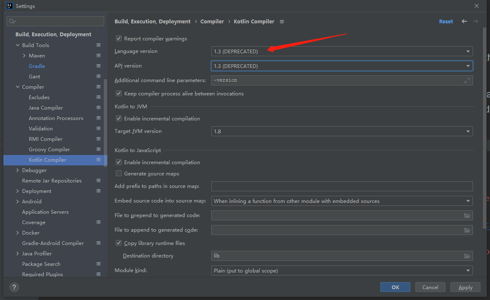
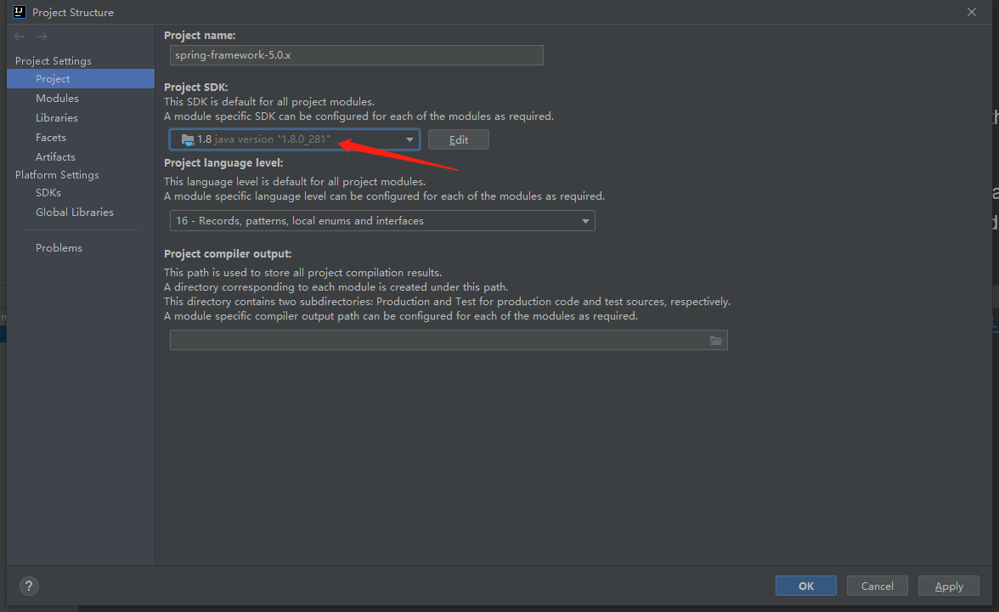
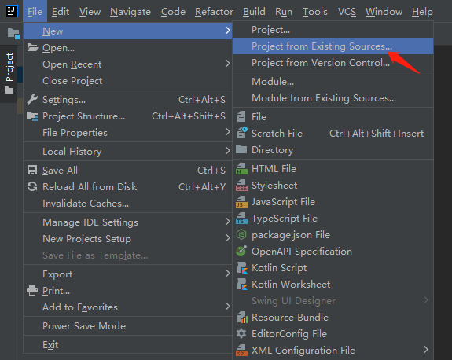
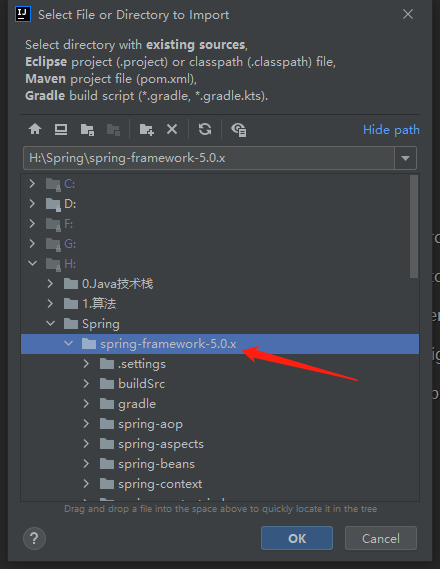
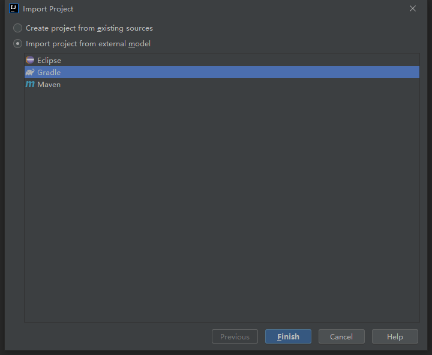

## Spring源码环境搭建


### 1. 编译工具及JDK

​		我们使用Intelli IDEA 2021.2来学习Spring源码，JDK版本为：1.8.0_281。


### 2. Spring源码下载

​		这里下载的版本是：spring-framework-5.0.x。

- github：https://github.com/spring-projects/spring-framework
- gitee：https://gitee.com/mirrors/Spring-Framework


### 3. Gradle配置

1. 确定Gradle版本：我们需要去到 spring源码根目录\gradle\wrapper下的 gradle-wrapper.properties 文件中进行查看。

```java
distributionBase=GRADLE_USER_HOME
distributionPath=wrapper/dists
zipStoreBase=GRADLE_USER_HOME
zipStorePath=wrapper/dists
distributionUrl=https\://services.gradle.org/distributions/gradle-4.4.1-bin.zip
```

​		可以看到我们这个版本的Spring对应的gradle的版本是4.4.1。


2. 下载gradle：下载地址：https://services.gradle.org/distributions/ 。

    在里面找到对应的gradle版本，点击下载即可。

    

3. 安装及环境变量配置

    下载后解压到指定目录下即可。

    - 添加系统环境变量：

    ```java
    // 变量名
    GRADLE_HOME
    // 变量值（gradle解压地址）
    D:\gradle-4.4.1
    ```

    再将 %GRADLE_HOME%\bin 配置到 path 环境变量中即可。

    - 修改一下gradle库的位置，否则会默认下载到c盘

     新建一个文件夹：D:\gradle_repo。与前面类似，添加系统环境变量：GRADLE_USER_HOME。

    

4. 配置结束后，cmd输入gradle -v 显示安装版本信息，说明安装成功。


### 4. Spring源码配置

1. 调整读取gradle文件的路径

​		将下载的gradle-4.4.1-bin.zip文件复制到 spring源码根目录\gradle\wrapper\ 下，并修改spring源码根目录**gradle\wrapper\gradle-wrapper.properties**文件，将distributionUrl更改为：

```JAVA
distributionUrl=gradle-4.4.1-bin.zip
```


2. 配置IDEA

​		我们需要在idea的setting中，更改一下gradle的库位置。



还需完成一下配置：








3. IDEA导入Spring源码项目

打开IDEA，选择：



直接选择你的项目：



然后导入：




文件下载过程中可能出现下面的问题：

```java
Could not GET 'https://repo.spring.io/plugins-release/io/spring/gradle/propdeps-plugin/0.0.9.RELEASE/propdeps-plugin-0.0.9.RELEASE.pom'. Received status code 401 from server:  Disable Gradle 'offline mode' and sync project
```

说明及解决：

​		要下载gradle插件或者spring依赖，官方的public仓库没有或者需要登陆才能下载，因此需要另外加上阿里云的gradle/spring仓库。

​		把build.gradle里所有的仓库地址都换成阿里云仓库，记住可能有多处！！除buildscript{}闭包内要改repositories{}外，configure(allprojects) {}闭包里的repositories{}仓库地址也要改。

```java
repositories {
		//阿里云仓库全家桶
		maven{ url 'https://maven.aliyun.com/repository/central'}
		maven{ url 'https://maven.aliyun.com/repository/public' }
		maven{ url 'https://maven.aliyun.com/repository/google'}
		maven{ url 'https://maven.aliyun.com/repository/gradle-plugin'}
		maven{ url 'https://maven.aliyun.com/repository/spring'}
		maven{ url 'https://maven.aliyun.com/repository/spring-plugin'}
		maven{ url 'https://maven.aliyun.com/mvn/guide'}
		maven{ url 'https://maven.aliyun.com/repository/apache-snapshots'}
}
```

